# Multi-Layer Perceptron Configurations

---

## Introduction

This repository is a collection of experimental Python notebooks where each one deals with a different hyperparameter and observes the effect different values have on the model's performance. The configuration for every variation is the same except for the parameter being experimented upon.

The experiment utilizes a baseline Sequential Multi-Layer Perceptron. The parameters being tested are:
1. [Activation Functions](#activation-functions)
2. [Batch Size](#batch-size)
3. [Epochs](#epochs)
4. [Kernel Initializers](#kernel-initializers)
5. [Learning Rate](#learning-rate)
6. [Loss Functions](#loss-functions)
7. [Network Architectures](#network-architectures)
8. [Optimizers](#optimizers)

---

## File Structure:

- mlp-configurations (repo)
    - parameter
        - parameter.ipynb
        - parameter_result.csv
        - figures
            - all the figures generated from the notebook

---

## Activation Functions

An activation function is a function employed in each neuron inside an ANN which outputs a value for the correspondsing input based on a few different pre-defined methods.

In this experiment, the effect of 9 different activation functions was evaluated:
1. relu
2. sigmoid
3. softmax
4. softplus
5. softsign
6. tanh
7. selu
8. elu
9. exponential

Read more on Keras Documentation: [https://keras.io/api/layers/activations/](https://keras.io/api/layers/activations/)

These activation functions were used on all the layers except for the output layer which exclusively uses the softmax activation function.

 Index | Activation Function | Training Loss | Training Accuracy | Validation Loss | Validation Accuracy | Test Loss | Test Accuracy | Time (s) 
-------|---------------------|---------------|-------------------|-----------------|---------------------|-----------|---------------|----------
 6     | softmax             | 0.43          | 0.84              | 0.41            | 0.86                | 0.44      | 0.84          | 60.46    
 4     | softsign            | 0.39          | 0.84              | 0.35            | 0.85                | 0.39      | 0.83          | 63.49    
 8     | relu                | 0.45          | 0.83              | 0.42            | 0.84                | 0.46      | 0.82          | 57.05    
 1     | elu                 | 0.7           | 0.5               | 0.7             | 0.49                | 0.7       | 0.5           | 60.42    
 2     | selu                | 0.92          | 0.5               | 0.94            | 0.49                | 0.92      | 0.5           | 62.12    
 3     | tanh                | 0.7           | 0.5               | 0.7             | 0.49                | 0.7       | 0.5           | 55.92    
 5     | softplus            | 0.69          | 0.5               | 0.69            | 0.49                | 0.69      | 0.5           | 65.51    
 0     | exponential         | NaN           | 0.5               | NaN             | 0.51                | NaN       | 0.5           | 55.93    
 7     | sigmoid             | 0.69          | 0.5               | 0.69            | 0.51                | 0.69      | 0.5           | 84.1     
  

We can observe from the table above that using __softmax__ as the activation function for the input and hidden layers outperforms all the other activation functions with the highest accuracy of 0.84 and low loss of 0.44 with relatively comparable runtime to other functions. It is followed closely by the softsign and relu activation functions.

### PLots for All Activation Functions (Training)

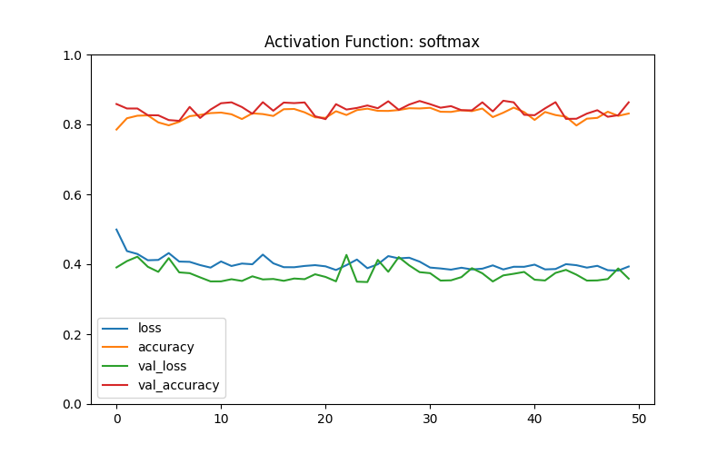
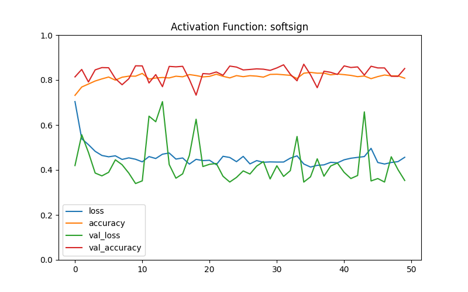
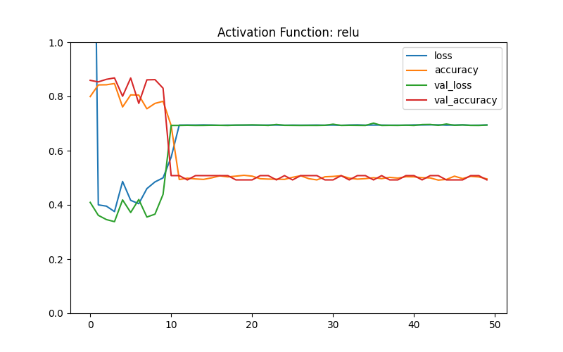
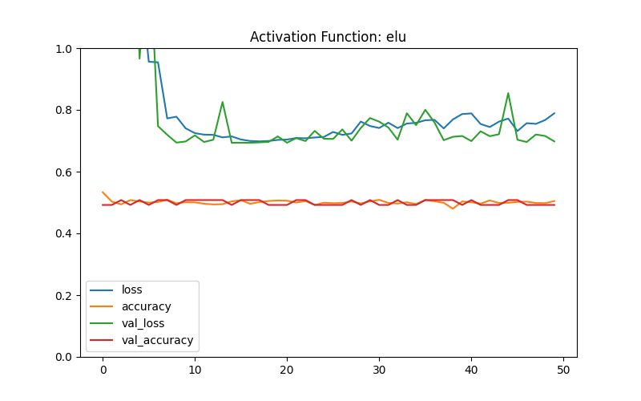
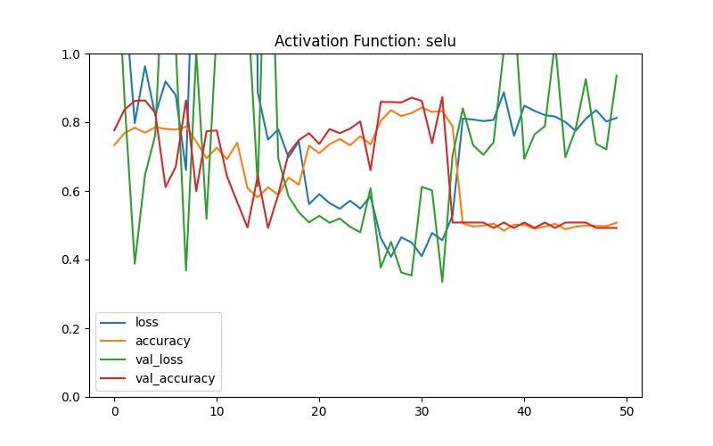
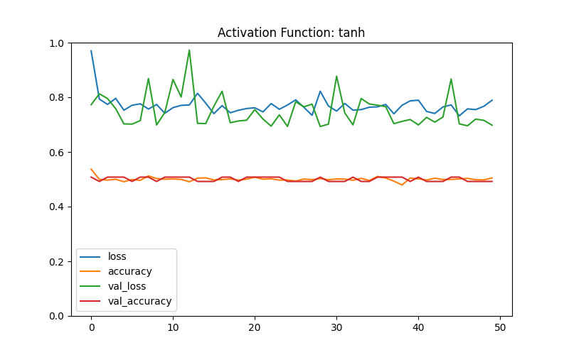
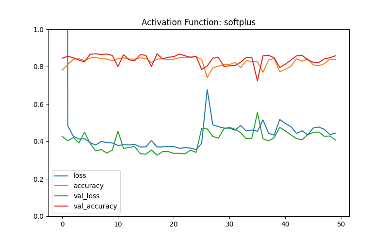
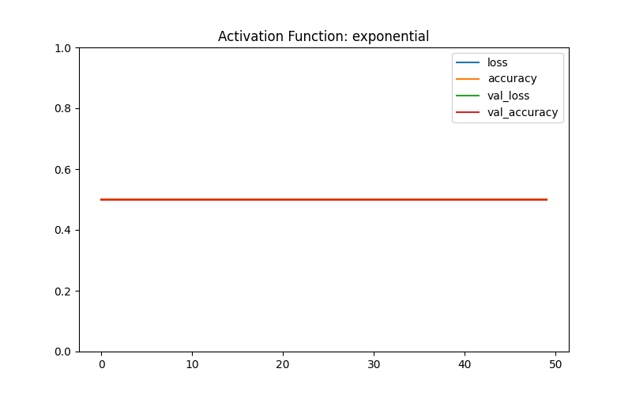
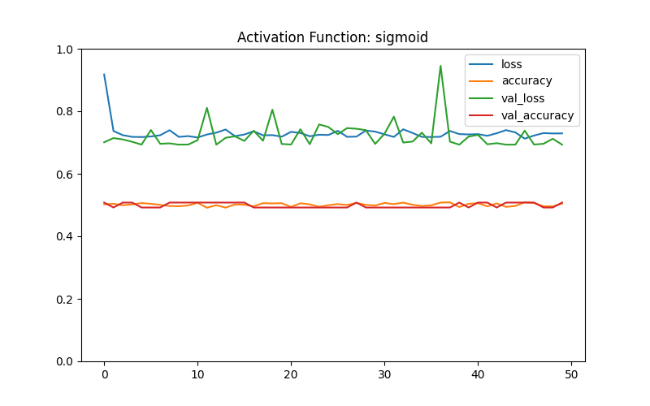

### Loss and Accuracy across Data Subsets

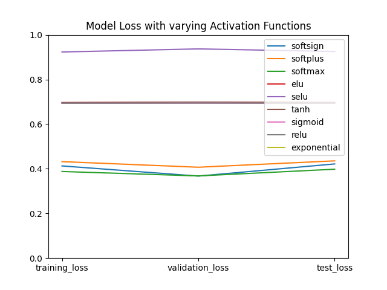
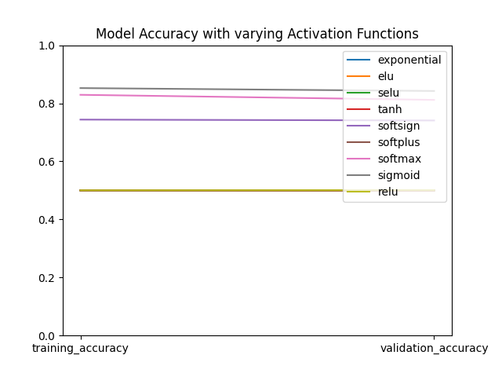

>[Back to Top](#introduction)

---

## Batch Size

The batch size in an ANN defines the number of samples used for training the network in each epoch. Using mini-batch for smaller batch sizes makes training less computationally intensive and let's us train our networks quickly. The batch sizes used in this experiment are:
1. 16
2. 32
3. 64
4. 128
5. 256
6. 512

 Index | Batch Size | Training Loss | Training Accuracy | Validation Loss | Validation Accuracy | Test Loss | Test Accuracy | Time (s) 
-------|------------|---------------|-------------------|-----------------|---------------------|-----------|---------------|----------
 0     | 512        | 0.35          | 0.86              | 0.32            | 0.87                | 0.35      | 0.85          | 18.86    
 1     | 256        | 0.36          | 0.85              | 0.33            | 0.87                | 0.37      | 0.85          | 22.43    
 3     | 64         | 0.36          | 0.85              | 0.33            | 0.87                | 0.37      | 0.85          | 43.22    
 2     | 128        | 0.4           | 0.86              | 0.38            | 0.87                | 0.43      | 0.84          | 25.62    
 4     | 32         | 0.4           | 0.85              | 0.37            | 0.86                | 0.42      | 0.84          | 61.59    
 5     | 16         | 0.69          | 0.5               | 0.69            | 0.51                | 0.69      | 0.5           | 145.16   

We can observe from the table above that a bigger batch size led to lower loss and higher accuracy across training, validation and test sets. Although this may not be the case for every implementation, adjusting the number of epochs alongside can bring about a change in the results. Here, the number of epochs was static to 50.

### Plots for All Batch Sizes (Training)

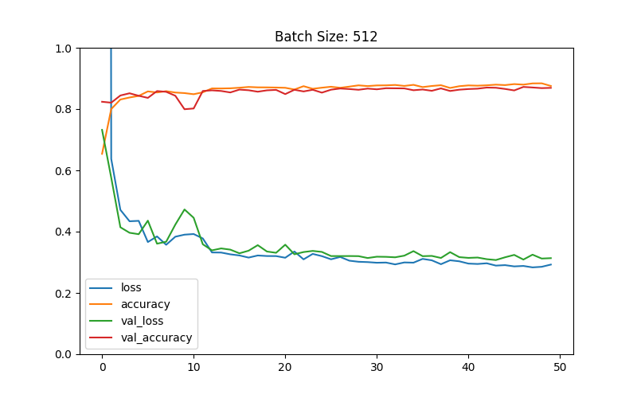
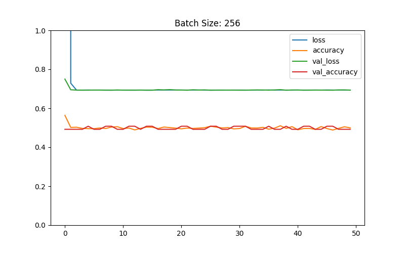
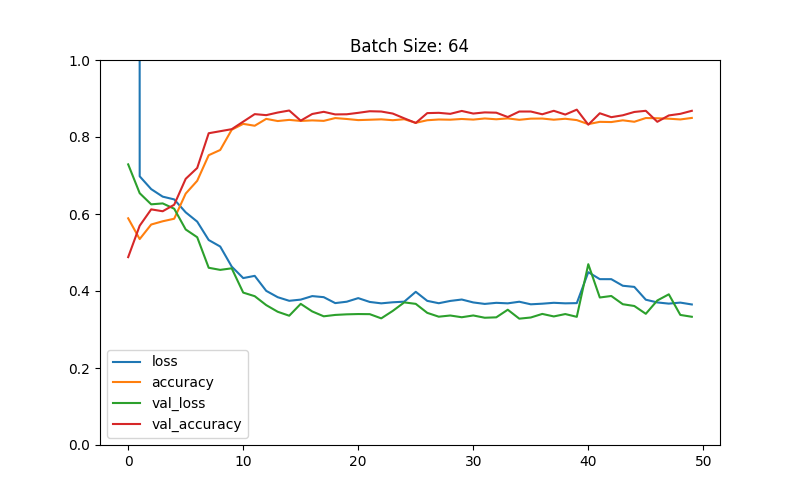
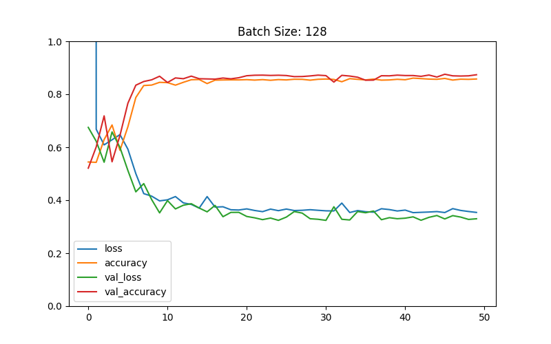
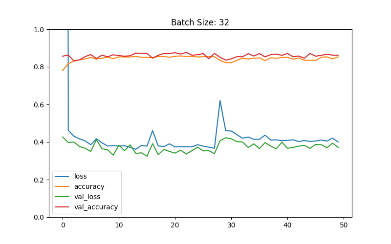
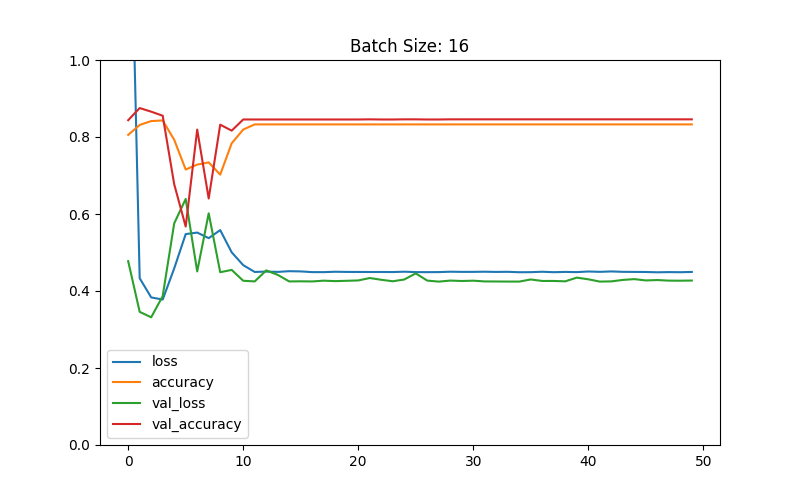

### Loss and Accuracy across Data Subsets

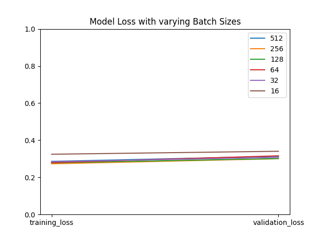
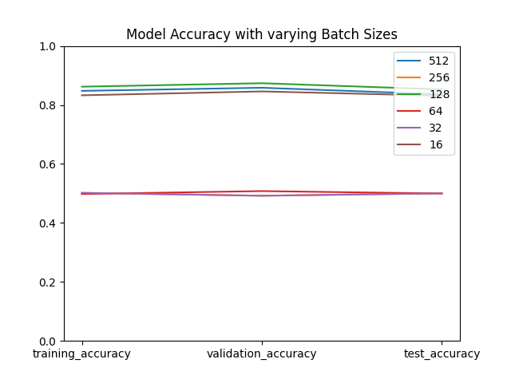

>[Back to Top](#introduction)

---

## Epochs

The number of epochs refers to the number of times a neural network is trained on a certain data. The data can be the entire dataset but in different order to generalize the model or we can use mini-batch as from the previous section to train our model on different sample sets. More epochs help us generalize the model but require more time and computational power.

 Index | Epochs | Training Loss | Training Accuracy | Validation Loss | Validation Accuracy | Test Loss | Test Accuracy | Time (s) 
-------|--------|---------------|-------------------|-----------------|---------------------|-----------|---------------|----------
 3     | 50     | 0.36          | 0.85              | 0.34            | 0.86                | 0.37      | 0.84          | 54.52    
 1     | 200    | 0.46          | 0.82              | 0.43            | 0.84                | 0.47      | 0.82          | 212.79   
 4     | 25     | 0.44          | 0.81              | 0.44            | 0.81                | 0.46      | 0.79          | 27.93    
 5     | 10     | 0.54          | 0.73              | 0.51            | 0.75                | 0.54      | 0.72          | 45.58    
 0     | 500    | 0.7           | 0.5               | 0.69            | 0.51                | 0.7       | 0.5           | 521.15   
 2     | 100    | 0.69          | 0.5               | 0.69            | 0.51                | 0.69      | 0.5           | 106.85   

It is interesting to note that we get the best performance from 50 epochs followed by 200 epochs while 100 epochs which sits somwhere between the 2 values demonstrates the worst performance across the board.

### Plots for All Epoch Sizes (Training)

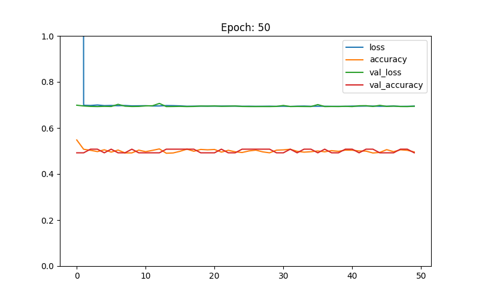
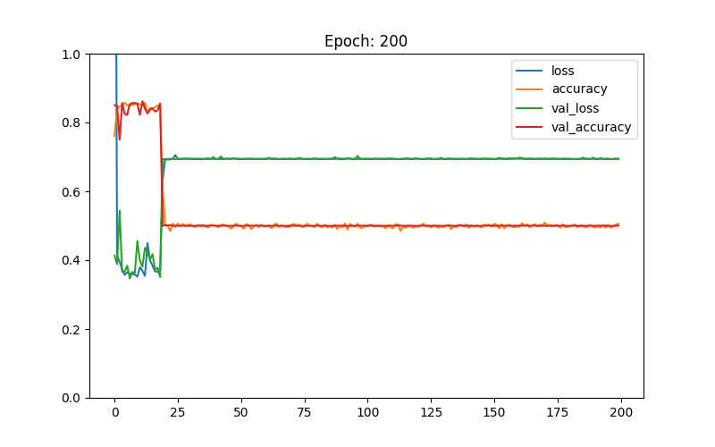
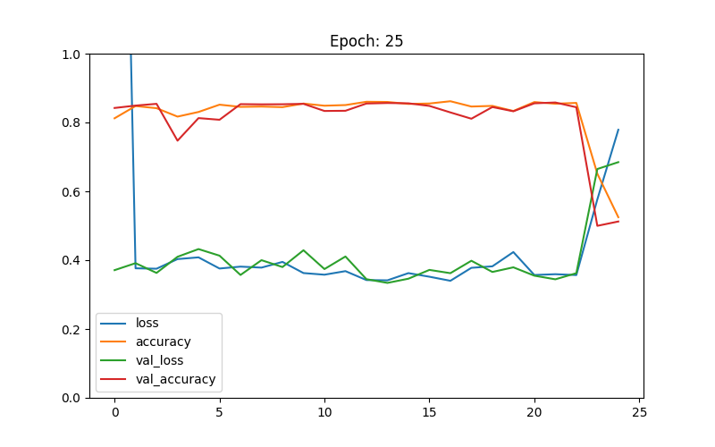
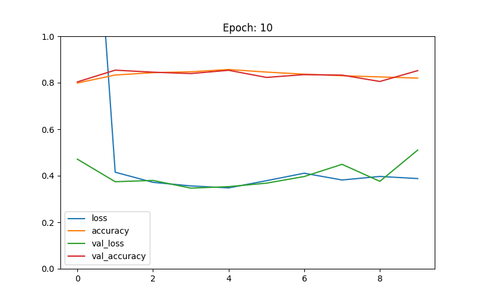
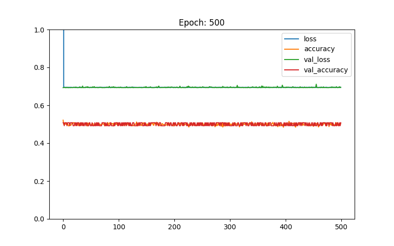
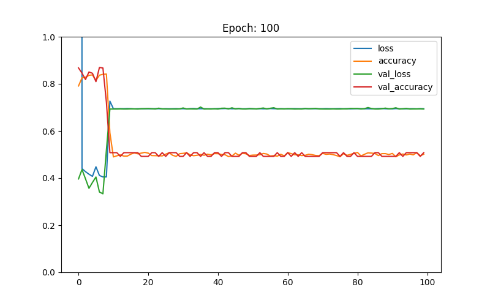

### Loss and Accuracy across Data Subsets

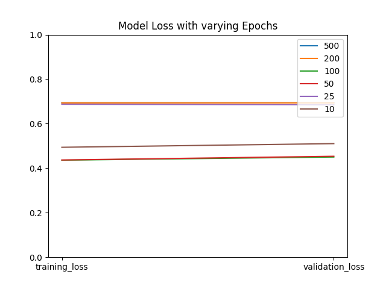
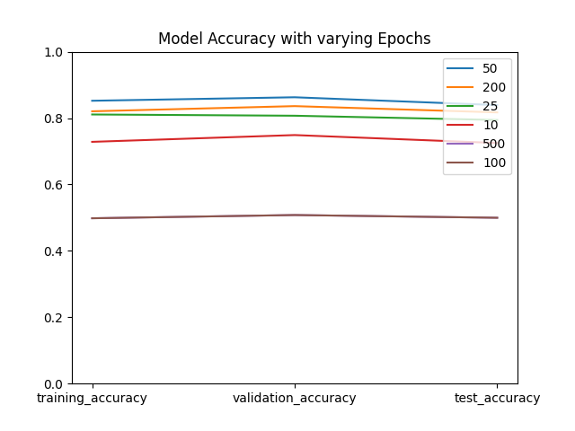

>[Back to Top](#introduction)

---

## Kernel Initializers

Kernel initializers define the different ways to initialize the weights in a network. Following kernel initializers are implemented in this experiment:
1. Random Normal
2. Random Uniform
3. Truncated Normal
4. Zeros
5. Ones
6. Glorot Normal
7. Glorot Uniform
8. He Normal
9. He Uniform
10. Identity
11. Orthogonal
12. Constant
13. Variance Scaling

Read more on Keras Documentation: [https://keras.io/api/layers/initializers/#usage-of-initializers](https://keras.io/api/layers/initializers/#usage-of-initializers)

 Index | Kernel Initializers | Training Loss | Training Accuracy | Validation Loss | Validation Accuracy | Test Loss | Test Accuracy | Time (s) 
-------|---------------------|---------------|-------------------|-----------------|---------------------|-----------|---------------|----------
 0     | variance_scaling    | 0.32          | 0.87              | 0.3             | 0.88                | 0.34      | 0.86          | 58.35    
 12    | random_normal       | 0.33          | 0.87              | 0.31            | 0.88                | 0.34      | 0.86          | 61.98    
 3     | identity            | 0.36          | 0.86              | 0.33            | 0.87                | 0.37      | 0.84          | 84.45    
 5     | he_normal           | 0.39          | 0.85              | 0.37            | 0.85                | 0.41      | 0.84          | 61.74    
 2     | orthogonal          | 0.38          | 0.84              | 0.36            | 0.86                | 0.38      | 0.84          | 59.18    
 1     | constant            | 0.69          | 0.5               | 0.69            | 0.49                | 0.69      | 0.5           | 59.33    
 4     | he_uniform          | 0.69          | 0.5               | 0.69            | 0.49                | 0.69      | 0.5           | 58.47    
 6     | glorot_uniform      | 0.69          | 0.5               | 0.69            | 0.49                | 0.69      | 0.5           | 58.89    
 7     | glorot_normal       | 0.69          | 0.5               | 0.69            | 0.49                | 0.69      | 0.5           | 58.75    
 8     | ones                | 0.69          | 0.5               | 0.69            | 0.49                | 0.69      | 0.5           | 59.58    
 9     | zeros               | 0.69          | 0.5               | 0.69            | 0.49                | 0.69      | 0.5           | 84.16    
 10    | truncated_normal    | 0.69          | 0.5               | 0.69            | 0.49                | 0.69      | 0.5           | 58.83    
 11    | random_uniform      | 0.69          | 0.5               | 0.69            | 0.49                | 0.69      | 0.5           | 58.05    

Among all the kernel initializers, there are few that demonstrate a good performance like variance scaling, random normal, identity and he normal. While others seem to have a similar effect on the loss and accuracy across the board.

### Plots for All Kernel Initializers (Training)

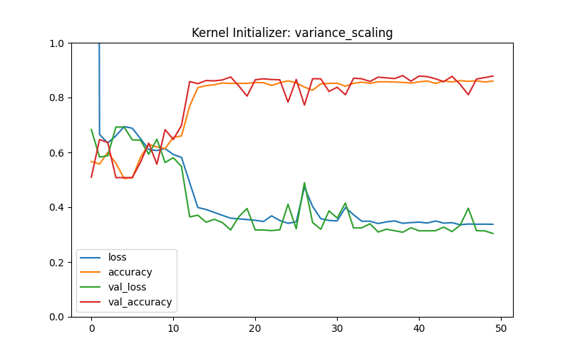
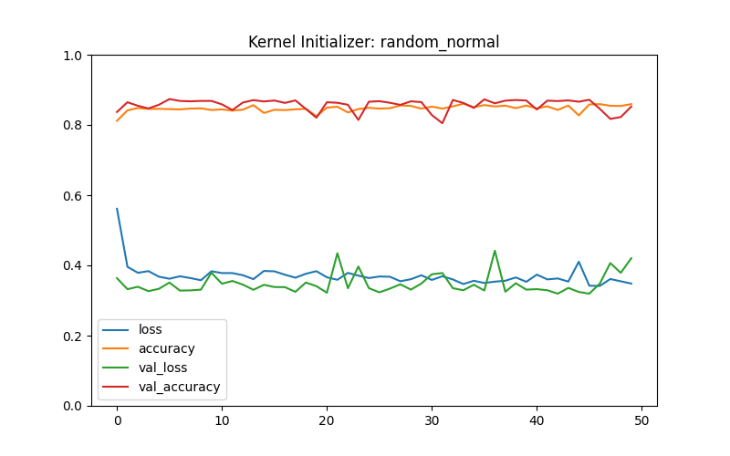
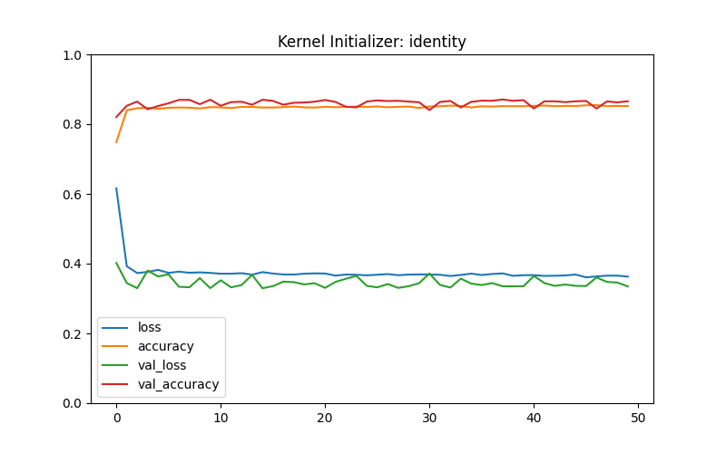
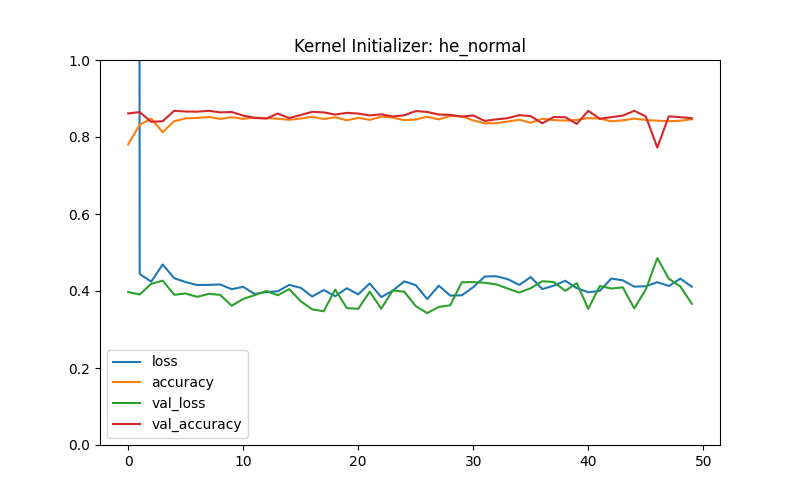
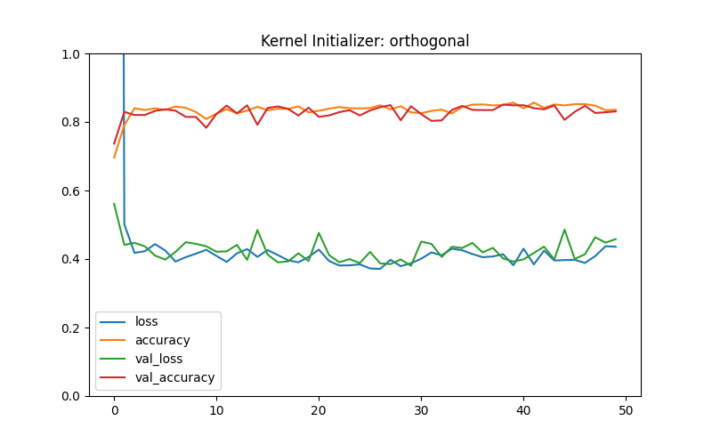
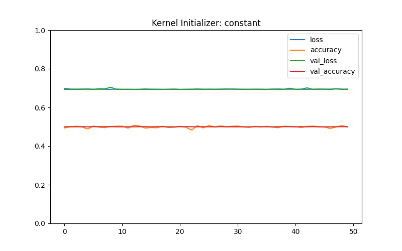
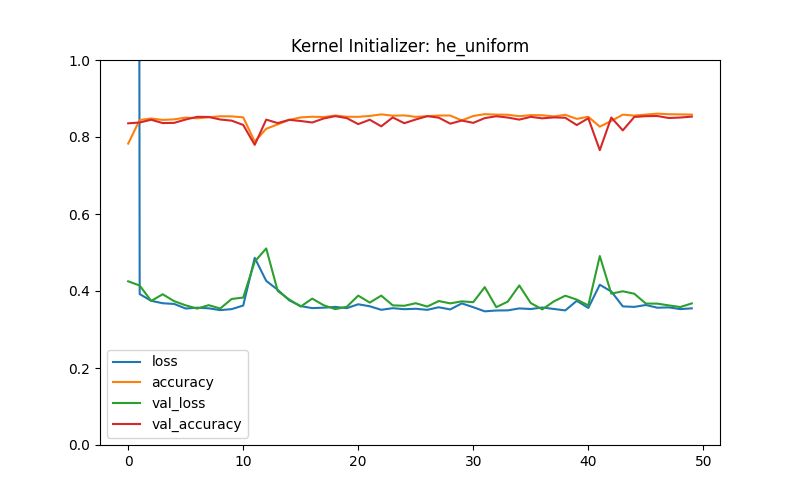
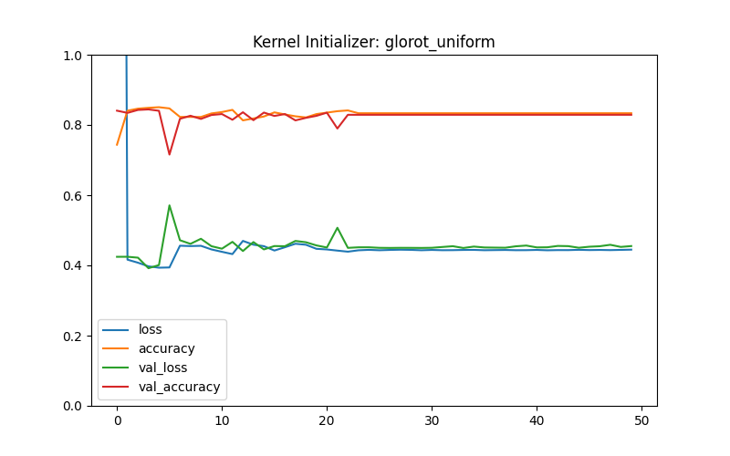
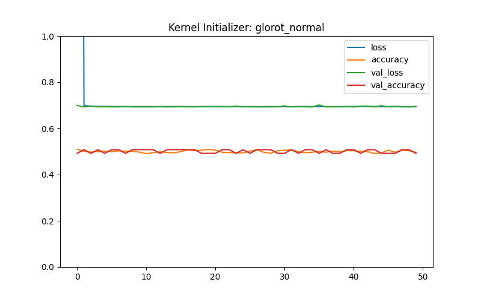
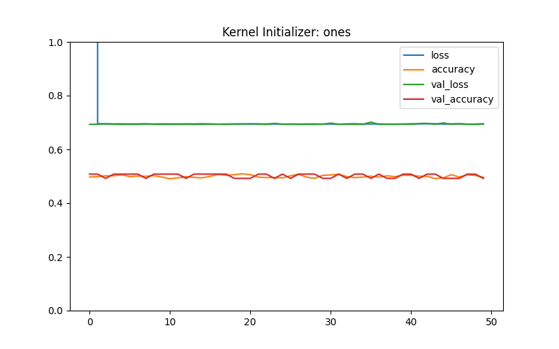
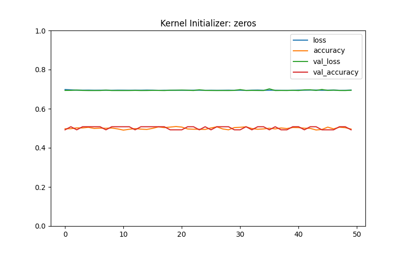
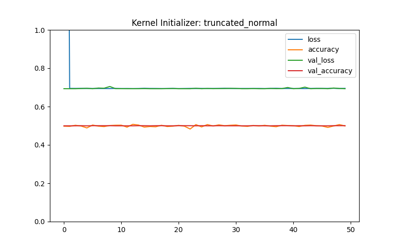
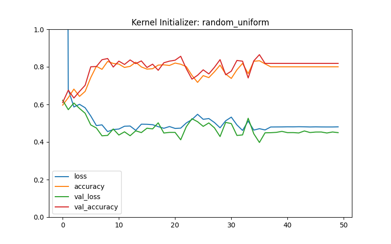

### Loss and Accuracy across Data Subsets

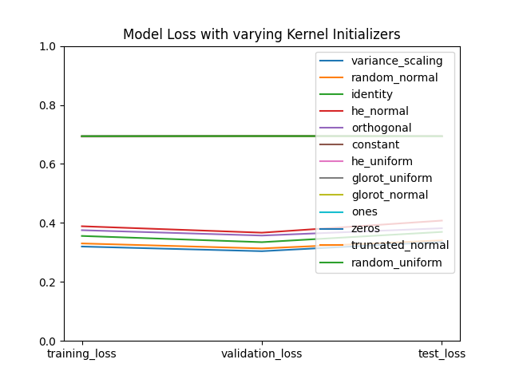
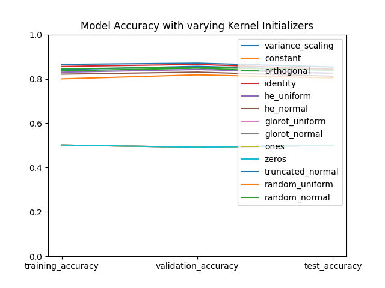

>[Back to Top](#introduction)

---

## Learning Rate

Learning rate is a hyperparamter used during gradient descent to control and scale the magnitude of parameter updates. It determines how big or small the steps are during learning. The following values for learning rate were used in the experiment:
1. 0.001
2. 0.003
3. 0.01
4. 0.03
5. 0.1
6. 0.3

 Index | Learning Rates | Training Loss | Training Accuracy | Validation Loss | Validation Accuracy | Test Loss | Test Accuracy | Time (s) 
-------|----------------|---------------|-------------------|-----------------|---------------------|-----------|---------------|----------
 4     | 0              | 0.26          | 0.89              | 0.29            | 0.88                | 0.31      | 0.87          | 65.65    
 3     | 0.01           | 0.29          | 0.88              | 0.29            | 0.88                | 0.32      | 0.86          | 85.36    
 5     | 0              | 0.29          | 0.88              | 0.31            | 0.87                | 0.33      | 0.86          | 65.63    
 2     | 0.03           | 0.33          | 0.86              | 0.32            | 0.86                | 0.35      | 0.85          | 67.1     
 1     | 0.1            | 0.46          | 0.82              | 0.44            | 0.84                | 0.46      | 0.83          | 65.3     
 0     | 0.3            | 0.7           | 0.5               | 0.7             | 0.51                | 0.7       | 0.5           | 63.96    

We can observe from the table that a smaller learning rate generally leads to a minimum loss and maximum accuracy, however, too small a learning rate can take more time and even settle on a local minimum rather than global minimum. In this experiement, the learning rate 0.003 demonstrates the best performance.

### Plots for All Learning Rates (Training)

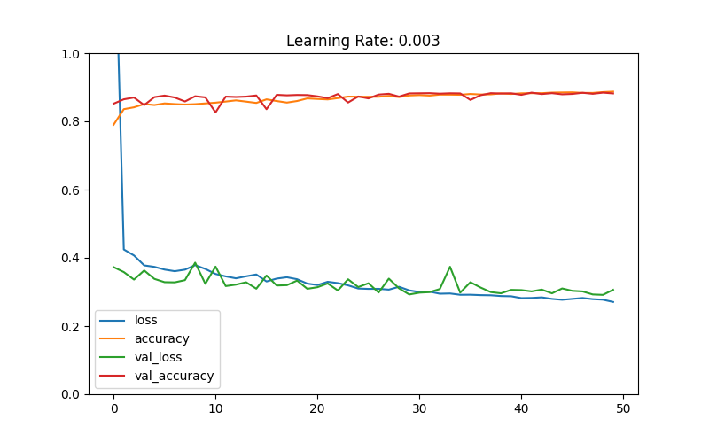
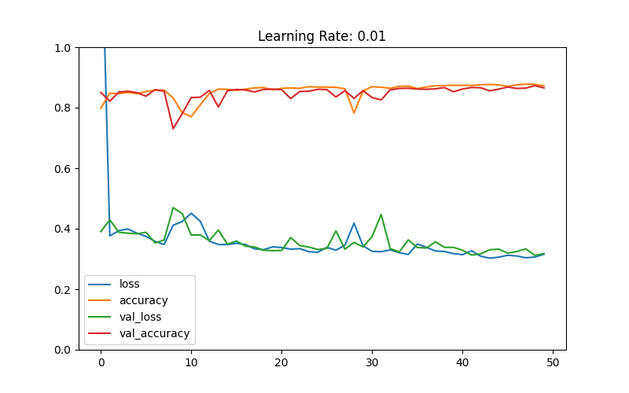
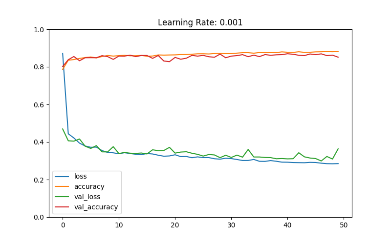
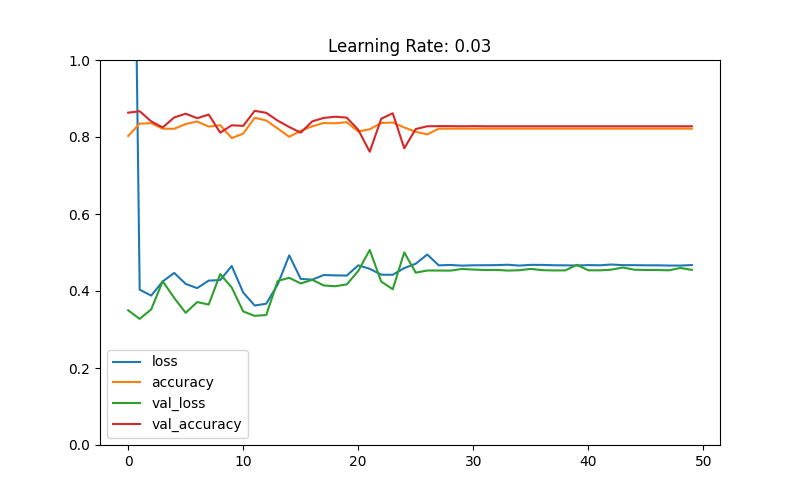
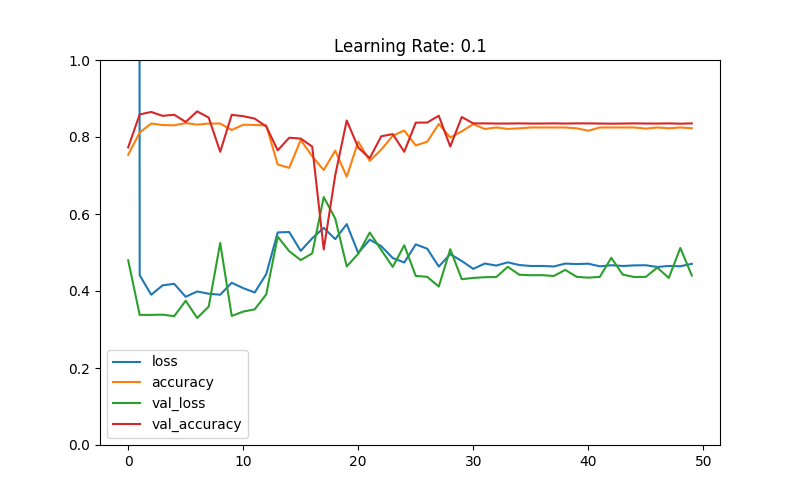
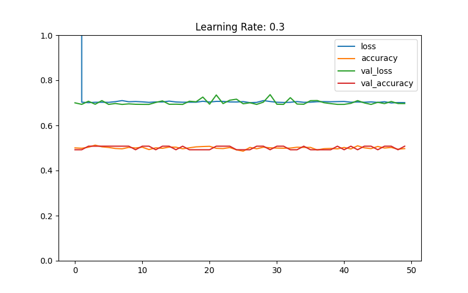

### Loss and Accuracy across Data Subsets

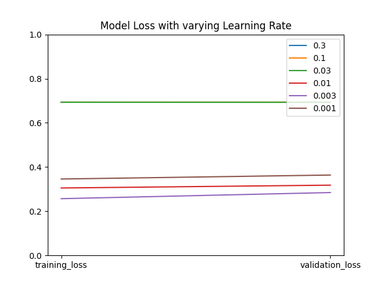
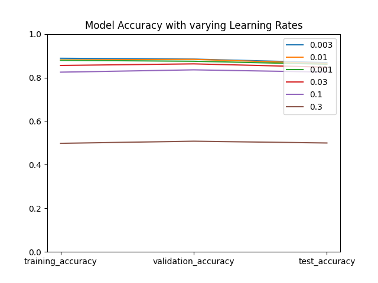

>[Back to Top](#introduction)

---

## Loss Functions

Loss functions are used to determine the loss (difference between the predicted and expected result). This is one of the primary goals for a leanring algorithm where it aims to minimize the loss (or error). There are two types of losses - probabilistic and regression losses used for classification/probability and regression use cases respectively. Following are the loss functions implemented in this experiement:
1. Binary Crossentropy
2. Categorical Crossentropy
3. Poisson
4. KL Divergence
5. Hinge
6. Squared Hinge
7. Categorical Hinge

Read more about Probabilistic Loss Functions: [https://keras.io/api/losses/probabilistic_losses/](https://keras.io/api/losses/probabilistic_losses/)

Read more about Hinge Loss Functions: [https://keras.io/api/losses/hinge_losses/](https://keras.io/api/losses/hinge_losses/)

 Index | Loss Functions           | Training Loss | Training Accuracy | Validation Loss | Validation Accuracy | Test Loss | Test Accuracy | Time (s) 
-------|--------------------------|---------------|-------------------|-----------------|---------------------|-----------|---------------|----------
 2     | hinge                    | 0.98          | 0.52              | 0.99            | 0.51                | 0.98      | 0.52          | 84.63    
 0     | categorical_hinge        | 1             | 0.5               | 1.02            | 0.49                | 1         | 0.5           | 66.05    
 4     | poisson                  | 4.51          | 0.5               | 4.59            | 0.49                | 4.53      | 0.5           | 75.51    
 5     | categorical_crossentropy | 0.69          | 0.5               | 0.69            | 0.49                | 0.69      | 0.5           | 70.68    
 6     | binary_crossentropy      | 0.69          | 0.5               | 0.69            | 0.49                | 0.69      | 0.5           | 70.38    
 1     | squared_hinge            | 1.5           | 0.5               | 1.48            | 0.51                | 1.5       | 0.5           | 72.29    
 3     | kl_divergence            | 8.09          | 0.5               | 7.93            | 0.51                | 8.06      | 0.5           | 65.71    

We can observe from the table that the accuracy is similar across all the loss functions, but the is minimal for categorical and binary crossentropy loss functions whereas it's quite high for other loss functions.

### Plots for All Loss Functions (Training)

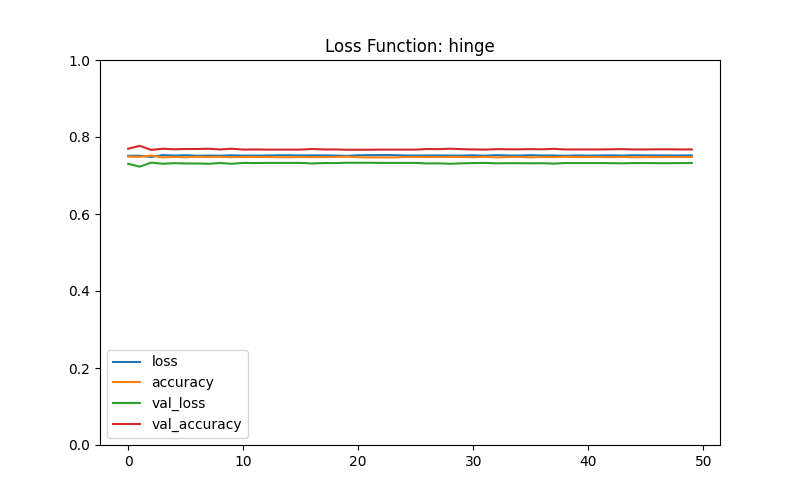
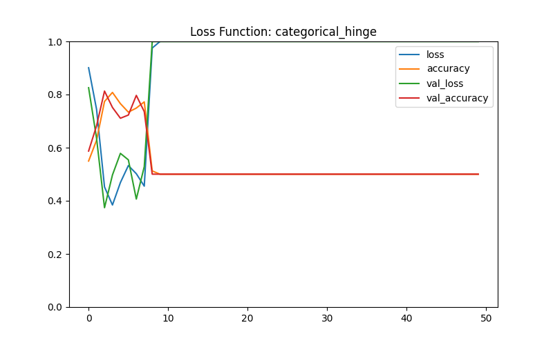
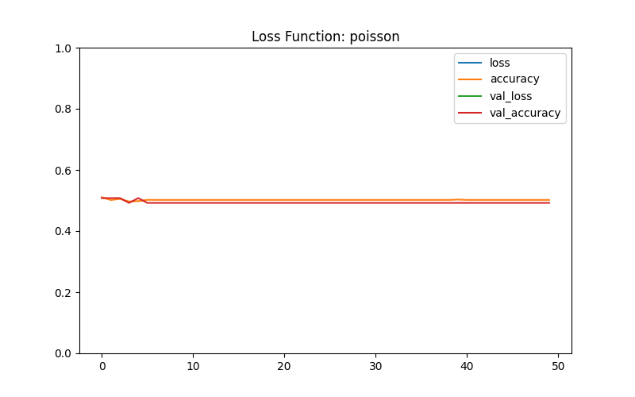
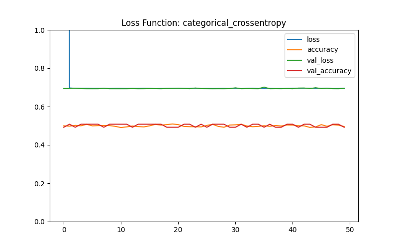
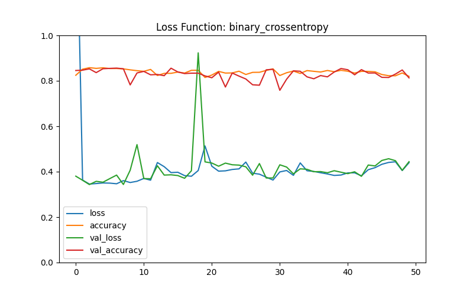
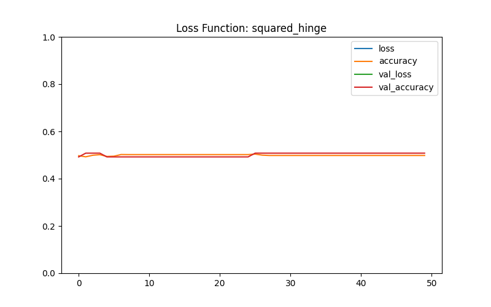
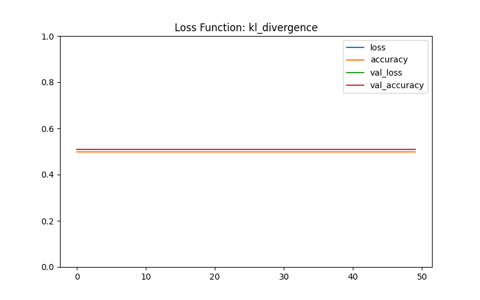

### Loss and Accuracy across Data Subsets

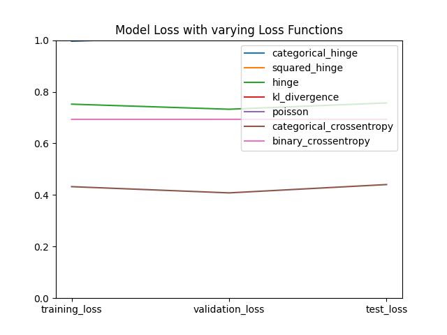
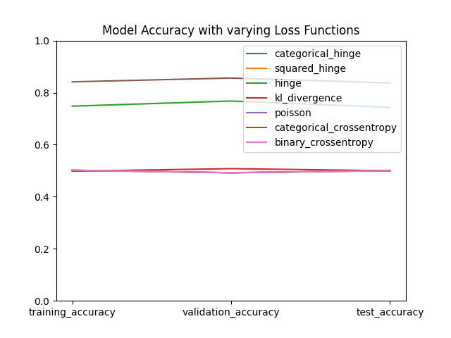

>[Back to Top](#introduction)

---

## Network Architectures

Network Architecture refers to the layout and design of a neural network. It determines the number of layers and the number of neurons in each layer. For this experiment, a range of different network architectures are implemented:
1. 128-2
2. 256-2
3. 156-128-2
4. 128-256-128-2
5. 512-256-128-96-2

 Index | Network Architectures | Training Loss | Training Accuracy | Validation Loss | Validation Accuracy | Test Loss | Test Accuracy | Time (s) 
-------|-----------------------|---------------|-------------------|-----------------|---------------------|-----------|---------------|----------
 3     | 256-2                 | 0.34          | 0.87              | 0.33            | 0.87                | 0.36      | 0.85          | 42.63    
 4     | 128-2                 | 0.35          | 0.86              | 0.33            | 0.87                | 0.36      | 0.85          | 42.42    
 2     | 256-128-2             | 0.36          | 0.85              | 0.34            | 0.86                | 0.37      | 0.84          | 46.77    
 0     | 512-256-128-96-2      | 0.48          | 0.8               | 0.45            | 0.82                | 0.47      | 0.81          | 81.42    
 1     | 128-256-128-2         | 0.69          | 0.5               | 0.69            | 0.49                | 0.69      | 0.5           | 52.79    

It is a popular misconception that the complexity of a model is proportional to its performance, however, in many cases simpler models tend to outperform the more complex and deep models, as is apparent from the table above. Two of the simplest models outperfrom the more complex models slightly.

### Plots for All Network Architectures (Structure)

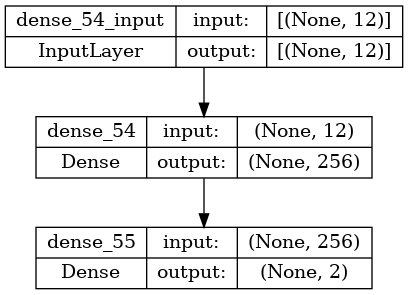
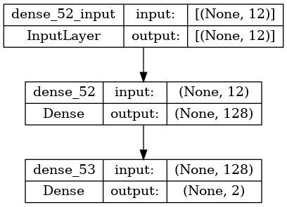
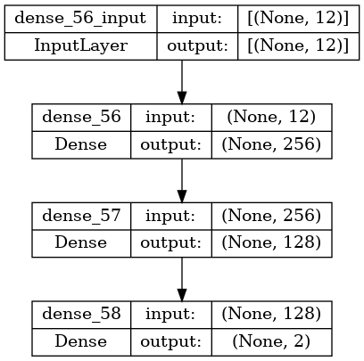
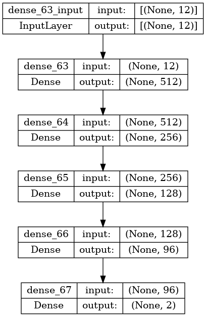
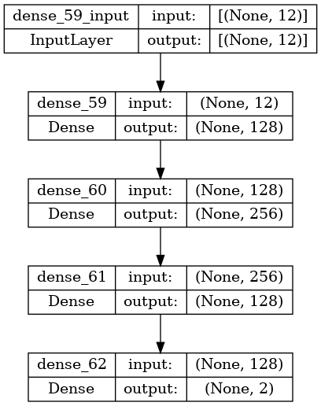

### Plots for All Network Architectures (Training)

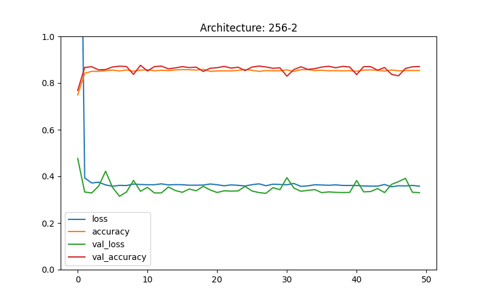
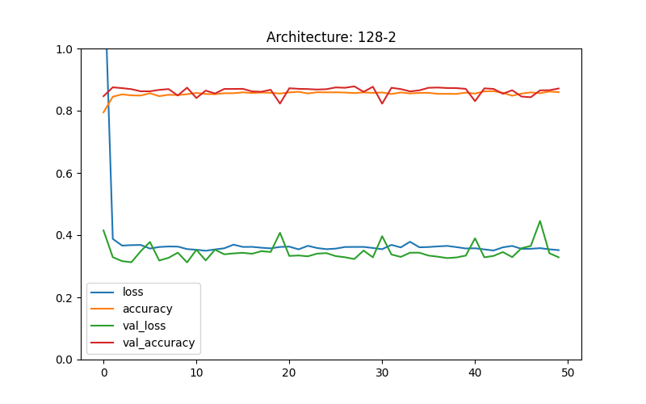
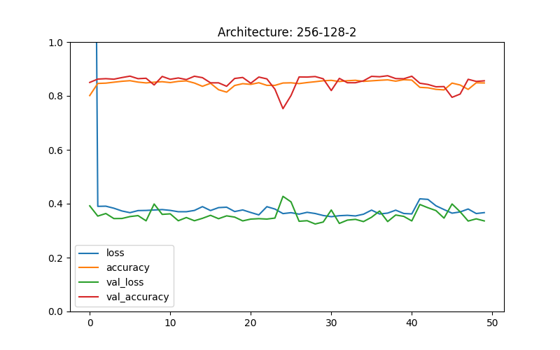
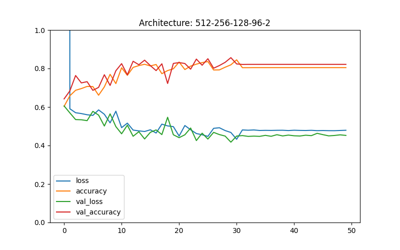
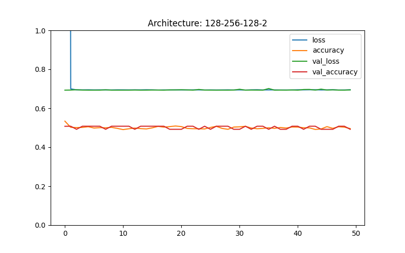

### Loss and Accuracy across Data Subsets

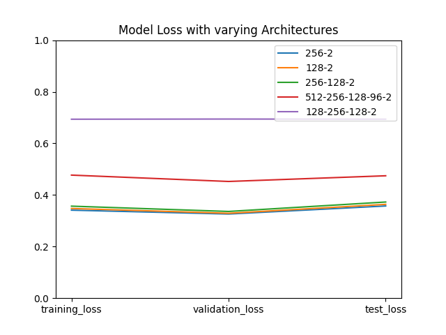
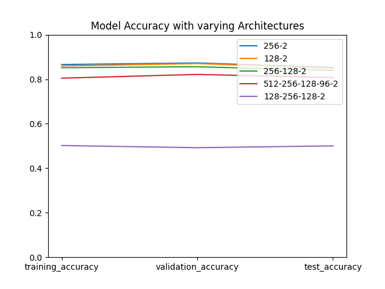

>[Back to Top](#introduction)

---

## Optimizers

An optimizer is an algorithm that modifies the attributes of a neural network to optimize the performance by minimizing the loss and improveing the accuracy. The following optimizers are implemented in this experiment:
1. SGD
2. RMSprop
3. Adam
4. AdamW
5. Adadelta
6. Adagrad
7. Adamax
8. Adafactor
9. Nadam
10. Ftrl

Read more about optimizers on Keras Docs: [https://keras.io/api/optimizers/](https://keras.io/api/optimizers/)

 Index | Optimizers | Training Loss | Training Accuracy | Validation Loss | Validation Accuracy | Test Loss | Test Accuracy | Time (s) 
-------|------------|---------------|-------------------|-----------------|---------------------|-----------|---------------|----------
 3     | Adamax     | 0.26          | 0.89              | 0.3             | 0.88                | 0.33      | 0.87          | 58.28    
 0     | Ftrl       | 0.31          | 0.87              | 0.3             | 0.88                | 0.33      | 0.86          | 60.32    
 5     | Adadelta   | 0.35          | 0.87              | 0.36            | 0.87                | 0.4       | 0.86          | 58.69    
 4     | Adagrad    | 0.3           | 0.88              | 0.31            | 0.88                | 0.34      | 0.85          | 53.19    
 1     | Nadam      | 0.69          | 0.5               | 0.69            | 0.49                | 0.69      | 0.5           | 61.76    
 6     | AdamW      | 0.69          | 0.5               | 0.69            | 0.49                | 0.69      | 0.5           | 60.66    
 7     | Adam       | 0.69          | 0.5               | 0.69            | 0.49                | 0.69      | 0.5           | 75.22    
 8     | RMSprop    | 0.69          | 0.5               | 0.69            | 0.49                | 0.69      | 0.5           | 89.29    
 2     | Adafactor  | NaN           | 0.5               | NaN             | 0.51                | NaN       | 0.5           | 59.18    
 9     | SGD        | NaN           | 0.5               | NaN             | 0.51                | NaN       | 0.5           | 146.27   

Adamax demonstrates the best performance followed by Ftrl, Adadelta and Adagrad; whereas other optimizers have a similar low performance with high loss and mediocre accuracy.

### Plots for All Optimizers (Training)

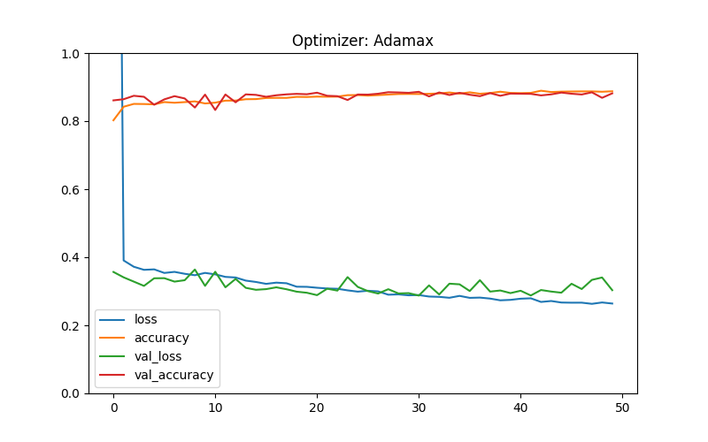
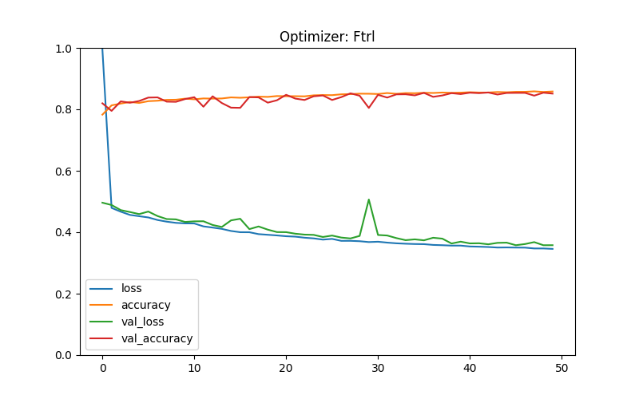
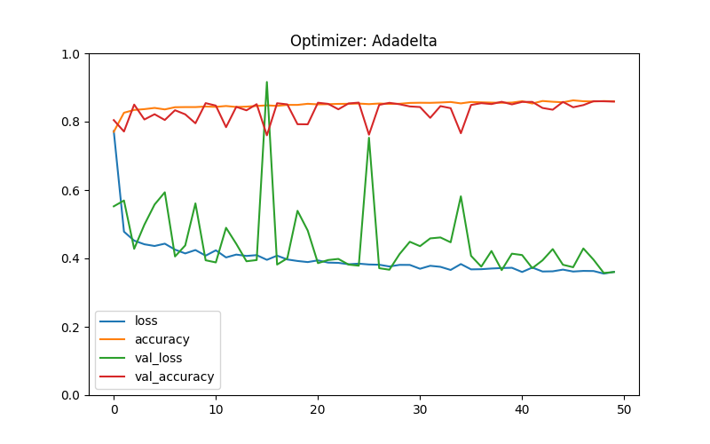
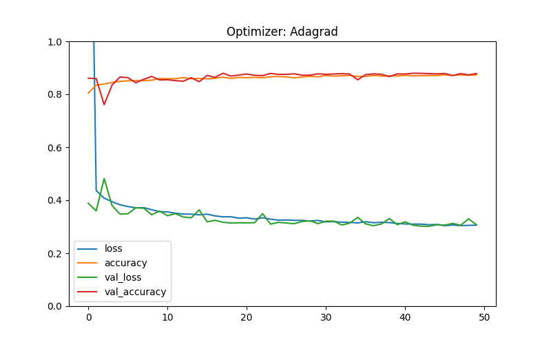
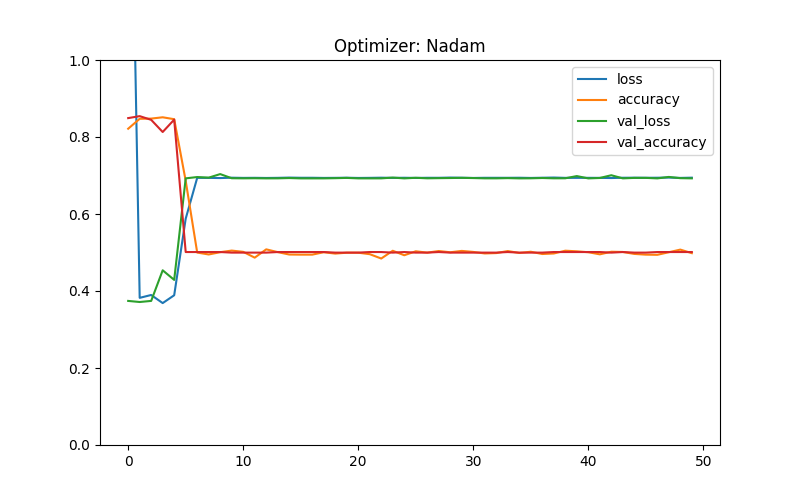
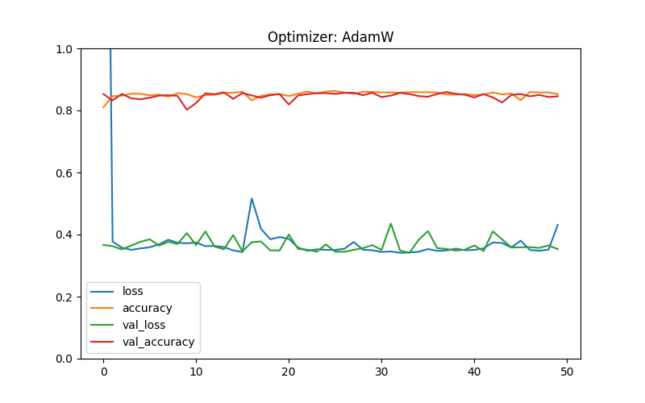
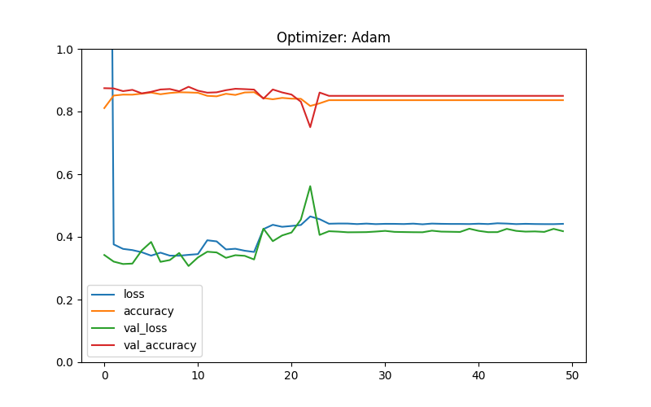
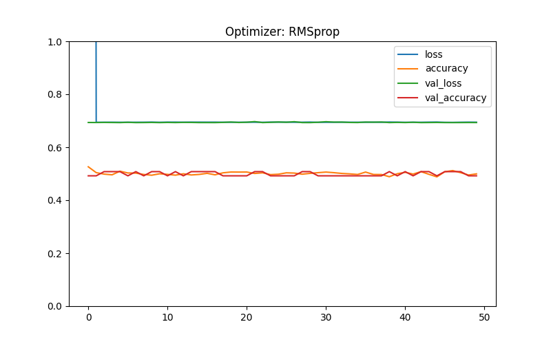
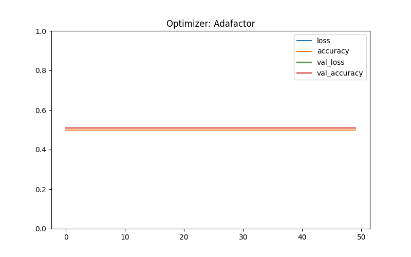
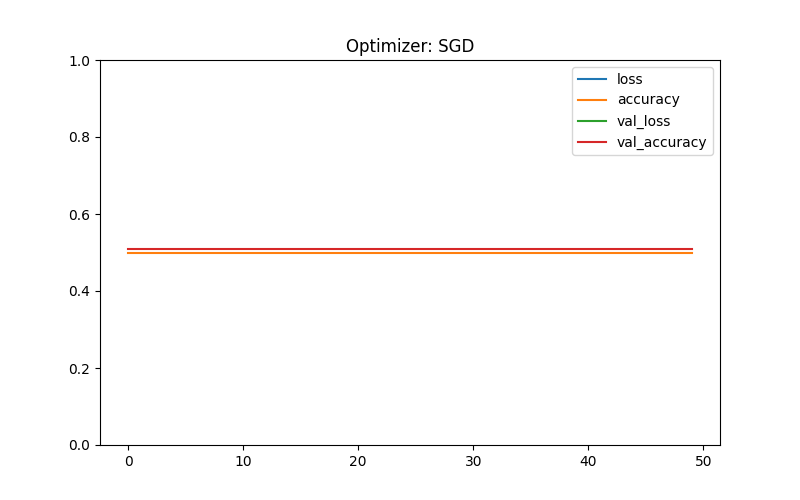

### Loss and Accuracy across Data Subsets

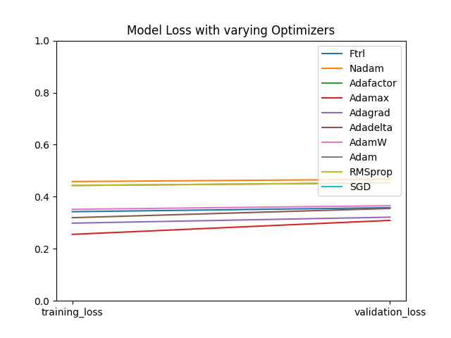
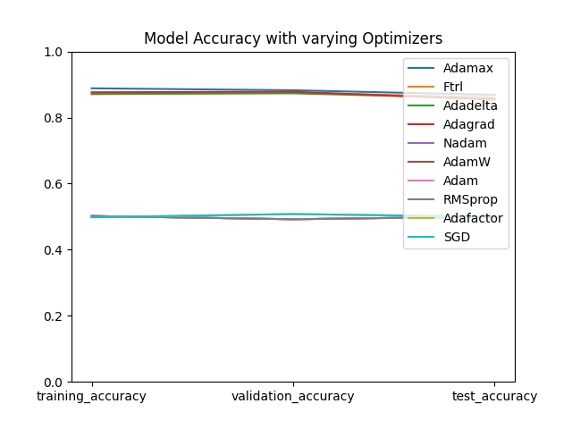

>[Back to Top](#introduction)

---